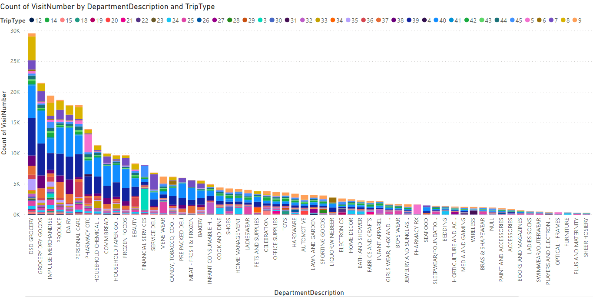
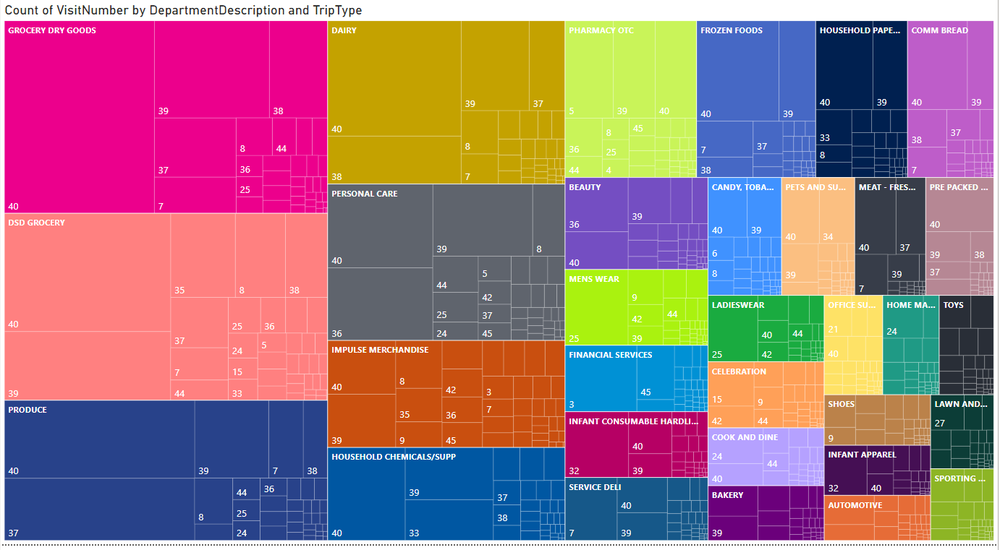
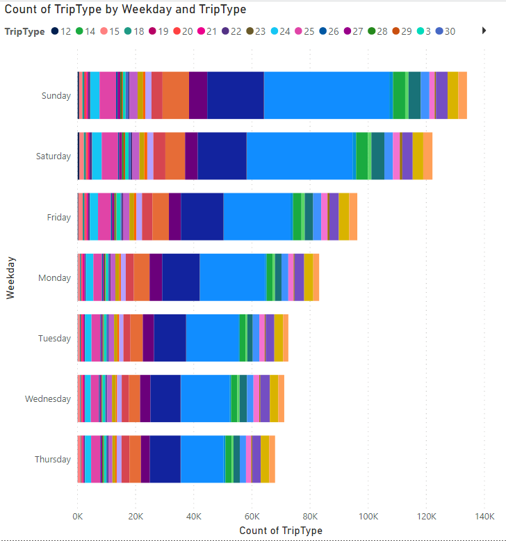
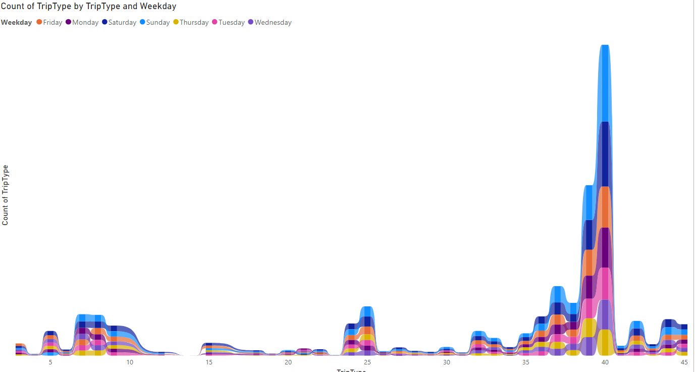

---
output:

  html_document:
    df_print: paged
---

# Comprehensión de los datos

Elaborado por:


+ Javier Valencia Goujon 123227
+ Mario Cruz García 123808
+ Miguel Ávila del Bosque 61100
+ Daniela Pinto Veizaga


### Análisis exploratorio de los datos de entrenamiento de Walmart


```{r message=FALSE, warning=FALSE}

knitr::opts_chunk$set(fig.align = 'center', message = FALSE, warning = FALSE)
library(tufte)
library(readr)
library(tidyverse)
library(ggplot2)
library(dplyr)
library(sqldf)
library(ggthemes)
```

```{r}
#Importing data
train <-read.csv("./data/train.csv", header = TRUE)

train
```

**Generalidades de la base de datos train**

La base de datos "train" consta de `647,054 observaciones` (registros) y `siete variables`. Cada registro representa la compra de un producto y contiene los siguentes campos:


|Variable|Description|
|--|--|
|TripTypr| Identificador categórico que representa el tipo de visita que realizó el cliente|
|VisitNumber| Número identificador de la visita a la que pertenece la compra.|
|Weekday| Día de la semana en el cuál se realizó la compra|
|Upc| Identificador del producto comprado|
|ScanCount| Número del unidades compradas de cada producto; un valor negativo significa que el producto fue devuelto|
|DepartmentDescription| Descripción del departamento de origen del producto|
|FinelineNumber| Variable categórica creada por Walmart, mediante el cuál se clasifican los productos en diversas categorías|

```{r, fig}
glimpse(train)

```

Dos de las siete variables de la base de datos (Upc, FinelineNumber), tienen valores `"NA"` en sus registros: cada uno 4129 valores faltantes.

En pasos futuros, procederemos a la imputación de los datos faltantes; no obstante lo anterior, ~4000 valores faltantes no representa un número grande, comparado con el total de registros: 647,054.

```{r}
summary(train)
train$TripType<-as.factor(train$TripType)

```

Ahora, sabemos que los registros en la base de datos representa el número de compras en Walmart, no así el número de visitas; entonces, para el saber el número de valores únicos en cada una de las columnas, aplicamos la siguientes funciones.

```{r}
train<-as_tibble(train)

#to see how many distinct values each variable has
train %>% summarise_all(list(~n_distinct(.)))
```


El resultado es que que en realidad, sólo existen:

+ 38 tipos de compras;
+ 95,674 visitas;
+ 7 días de la semana;
+ 97,715 distintos productos comprados;
+ 39 distintas maneras de registro de número del unidades compradas de cada producto;
+ 69 registros diferentes de departamentos
+ 5196 clasificaciones distintas de tipos de productos.


Revisemos cada uno de los valores únicos de las distintas variables:

```{r}

unique(train$DepartmentDescription)

unique(train$ScanCount)


```

Encontramos que a pesar de que aparentemente la variable `DepartmentDescription` no tiene missing values, en realidad sí tiene valores faltantes registrados como `NUll`. Veamos cuántos registros son `NULL`.

```{r}
filter(train, DepartmentDescription=="NULL") %>% dim()

```

Ok! La variable`DepartmentDescription` tiene con `1361` valores faltantes. Además, vemos que entre sus categorías existe las siguientes dos categorías que probablemente corresponden a la misma categoría: MENS WEAR y MENSWEAR.

```{r}
filter(train, DepartmentDescription=="MENS WEAR") %>% dim()
filter(train, DepartmentDescription=="MENSWEAR") %>% dim()
```


Para fácil análisis, cambiamos los datos "NULL" a "Na"s y homogeneizamos MENS WEAR y MENSWEAR en una sola categoría: MENS WEAR.

```{r}
#Limpiando los datos
train <-train %>% 
  mutate(DepartmentDescription= replace(DepartmentDescription, DepartmentDescription == 'MENSWEAR', "MENS WEAR"))
train <-train %>% 
  mutate(DepartmentDescription= replace(DepartmentDescription, DepartmentDescription == "NULL", NA))

```

```{r}
summary(train)

filter(train, DepartmentDescription=="MENSWEAR") %>% dim()
train %>% summarise_all(list(~n_distinct(.)))


```


## Univariado

### Número de Compras

```{r}

func_ubar <- function(data, variable, title){
  ggplot(data, aes(variable)) + 
  geom_bar(aes(y = (..count..)/sum(..count..))) + 
  scale_y_continuous(labels=scales::percent) +
  ylab("relative frequencies")+
  coord_flip()+
  ggtitle(title)+
  theme_tufte()

}

```


```{r}
func_ubar(train, train$Weekday, "Compras por Día de la Semana, Porcentaje")
```


```{r fig.height=12, fig.width=10}
func_ubar(train, train$TripType,"Compras por Tipo de Visita, Porcentaje" )

func_ubar(train, train$DepartmentDescription, "Compras por Departamento, Porcentaje")
```


## Bivariado


### Número de compras

```{r}

func_bibar <- function(data, variable, fill_by, title){
  ggplot(data, aes(variable)) + 
  geom_bar(aes(y = (..count..)/sum(..count..), fill=fill_by)) + 
  scale_y_continuous(labels=scales::percent) +
  ylab("relative frequencies")+
  coord_flip()+
  ggtitle(title)+
  theme_tufte()

}
```


```{r fig.height=12, fig.width=10}
func_bibar(train, train$TripType,train$Weekday,"Compras por Tipo de Visita y Día de la Semana, Porcentaje")

func_bibar(train, train$DepartmentDescription, train$Weekday,"Compras por Departamento y Día de la Semana, Porcentaje")
```

## Multivariado

### Compras por Departamento y Día de la Semana

```{r}
#Histograms of DepartmentDescription by Weekday
subseted_train = 0
plot = 0
for (i in unique(train$DepartmentDescription)) {
  subseted_train = subset(train, DepartmentDescription == i)
  plot <- ggplot(subseted_train, aes(x = Weekday)) +
    geom_histogram(stat="count") +
    labs(y= "Total Count", x = "Weekday", title=paste0(i, " by Weekday"), subtitle = "Counts by Number of Purchases")+
    coord_flip()+
    theme_tufte()

  print(plot)
}
```


### Compras por Tipo de Visita y Día de la Semana

```{r}

#Histograms of Triptypes by Weekday

subseted_train = 0
plot = 0
for (i in unique(train$TripType)) {
  subseted_train = subset(train, TripType == i)
  plot <- ggplot(subseted_train, aes(x = Weekday)) +
    geom_histogram(stat="count") +
    ggtitle(paste0(i, " Histogram by Weekday")) +
    labs(y= "Total Count", x = "Weekday")+
    coord_flip()+
    theme_tufte()

  print(plot)
}
```

### Compras por Departamento y Tipo de Visita


```{r}
#Histograms of Triptypes by Weekday

subseted_train = 0
plot = 0
for (i in unique(train$DepartmentDescription)) {
  subseted_train = subset(train, DepartmentDescription == i)
  plot <- ggplot(subseted_train, aes(x = TripType)) +
    geom_bar(stat="count") +
    ggtitle(paste0(i, " Histogram by TripType")) +
    labs(y= "Total Count", x = "TripType")+
    coord_flip()+
    theme_tufte()

  print(plot)
}
```

### Compras por Día de la Semana y Tipo de Visita


```{r}
subseted_train = 0
plot = 0
for (i in unique(train$Weekday)) {
  subseted_train = subset(train, Weekday == i)
  plot <- ggplot(subseted_train, aes(x = TripType)) +
    geom_bar(stat="count") +
    ggtitle(paste0(i, " Histogram by TripType")) +
    labs(y= "Total Count", x = "TripType")+
    coord_flip()+
    theme_tufte()

  print(plot)
}
```


### Compras por Día de la Semana y Departamento

```{r fig.height=10}
subseted_train = 0
plot = 0
for (i in unique(train$Weekday)) {
  subseted_train = subset(train, Weekday == i)
  plot <- ggplot(subseted_train, aes(x = DepartmentDescription)) +
    geom_bar(stat="count") +
    ggtitle(paste0(i, " Histogram by DepartmentDescription")) +
    labs(y= "Total Count", x = "DepartmentDescription")+
    coord_flip() +
    theme(axis.text = element_text(size = 8))+
    theme_tufte()

  print(plot)
}
```

####  Porcentaje de Compras por Tipo de visita y Departamento

```{r fig.height=10}
subseted_train = 0
plot = 0
for (i in unique(train$TripType)) {
  subseted_train = subset(train, TripType == i)
  plot <- ggplot(subseted_train, aes(x = DepartmentDescription)) +
    geom_bar(aes(y = (..count..)/sum(..count..))) +
    ggtitle(paste0("Tipo de Visita ", i, " por DepartmentDescription")) +
    labs(y= "Porcentaje", x = "DepartmentDescription")+
    scale_y_continuous(labels=scales::percent)+
    coord_flip()+
    theme_tufte()
  print(plot)
  
}
```

#### Graficas PowerBi Desktop






